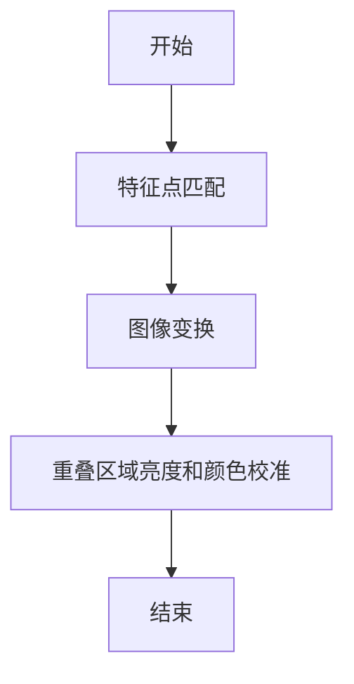

# 解决通过摄像头矫正多投影机的问题

包括winform前端
py后端（单独仓库）
py 主要是通过

## 整体方案流程图

```mermaid
graph TD;
    A[开始] --> B[特征点匹配]
    B --> C[图像变换]
    C --> D[重叠区域亮度和颜色校准]
    D --> E[结束]
```

非常的初级，下一步要增强鲁棒性，包括减少软件的bug和算法增强对环境光线的干扰，以及针对非平面情况的使用控制点配准的算法以及研究薄板样条曲线等
